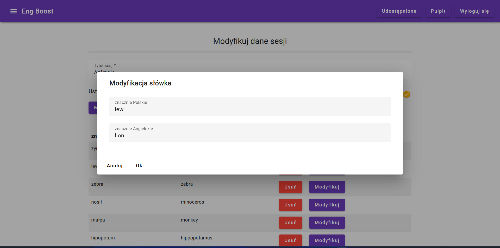
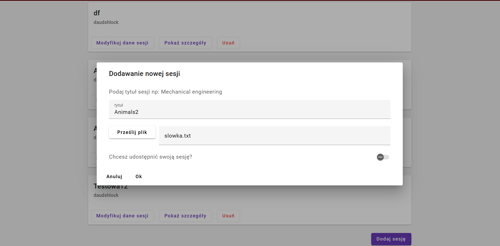
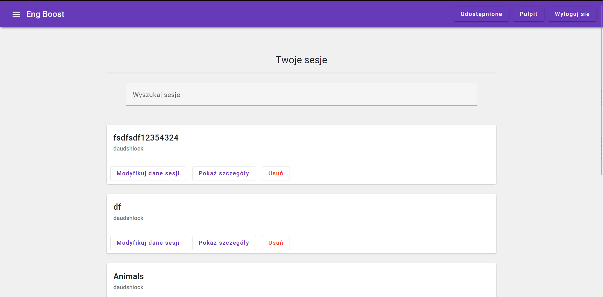

# EngBoost
### Frontend part

The functionalities of the application have been listed in the README file of the backend part of the project: https://github.com/adrianix2000/EngBoost_backend.git

I implemented the frontend part of the EngBoost application using the Angular framework and TypeScript.

The main libraries and technologies I used are:
* RxJs
* HttpCLient Module
* ReactiveForms
* Angular Materials
* SCSS
* HTML

#### How it looks like
Several screenshots presenting selected views of the application:

